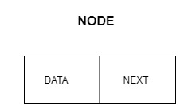
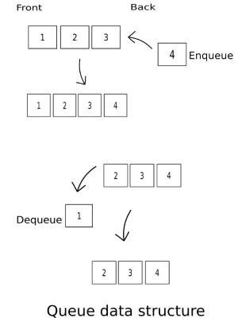
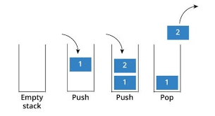
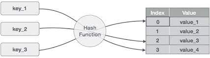

## Linked_Lists

---

### Table of Contents

- [Description](#description)
- [Implementation](#implementation)
- [References](#references)

---

## Description

This project explains basic data-elements and different ways to store it

#### Technologies

- Nodes
- Linked-list
- Stack
- Queue
- Hash Table

[Back To The Top](#Linked_Lists)

---

## Implementation 
- ### Node
Node has two container one of which stores data and other one store a reference to next node in a list.

- ### Linked List
A linked list is a linear collection of data elements(Nodes) and order of Nodes is base on each Node pointing to next Node. 

- ### Queue
Queue is a linear data structure which follows the First in, First Out Principle (FIFO) which mainly uses Nodes for storing and connecting data.

- ### Stack
Stack is a linear data structure which follows the First in, Last Out Principle (FILO) which mainly uses Nodes for storing and connecting data.

- ### HashTable
HashTable is a data structure that implements a set abstract data type, a structure that can map keys to values. A hash table uses a hash function to compute an index, also called a hash code, into an array of buckets or slots, from which the desired value can be found.

## References
https://en.wikipedia.org/wiki/Hash_table

https://en.wikipedia.org/wiki/Linked_list

https://en.wikipedia.org/wiki/Node_(computer_science)

https://en.wikipedia.org/wiki/Queue_(abstract_data_type)

https://en.wikipedia.org/wiki/Stack_(abstract_data_type)

[Back To The Top](#Linked_Lists)
